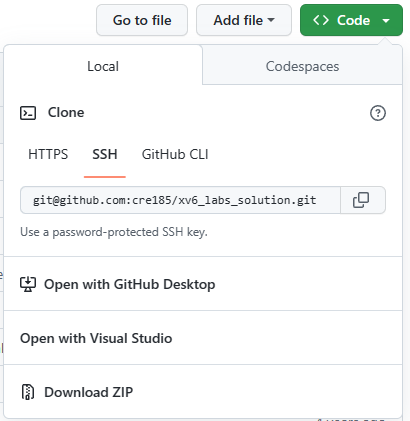

# Q&A File For Using Git (GitBash,github...)   
***Created by creeper185 2023.2.26***   

## 前言   
由于原来的电脑上有许多文件 换电脑时突然想存个备份 于是整起了git   
不用不知道 这玩意有这么多讲究 那就稍微探讨一下  
***
## 初见杀部分  
已有的仓库（以github上的仓库为例）会提供所谓的git代码  
在开始操作之前需要先有Git Bash在电脑上 没有的情况下点[这里](https://gitforwindows.org/)  
***
#### Git Bash  
打开Git Bash只需要右击任何一个文件夹然后选择Git Bash Here即可  
这里的任何一个文件夹当然也包括桌面 所以在桌面试着打开 没问题就行  
Git Bash的本质就是一个为git量身定做的cmd 在保留了一些cmd操作的同时 还支持你使用git指令  
cd ls mkdir等等简单的cmd命令都可以执行（其实挺全能的 我把Bash作为VSCode的默认命令行用 没有任何问题）
***
#### 配置  
在使用git命令之前先设置以下几点 为了连接到github还得费点功夫  
首先是设置用户名和邮箱 在Git Bash中输入以下代码：

    git config --global user.name "yourname"
    git config --global user.email "example@xxx.com"
替换成自己的内容 不过双引号要留着  
设置完成后可以用```git config -l```查看情况 如果出现自己设置的内容就算成功（在一堆内容的最底下）

然后是关于github上的ssh密钥设置  
其实不设置这个密钥也是可以用的 但是每次进行上传的时候都需要进行身份验证（输用户名密码） 实在有够烦人  
在自己常用的电脑上设置好密钥之后就可以在本机随便操作 同时在别的电脑上操作时仍然需要身份认证 安全性也没什么问题  
设置前检查一下自己有没有已经产生过密钥对 输入以下指令  

    cd ~/.ssh
    ls
如果发现存在叫做id_rsa&id_rsa.pub的两个文件 那么说明ssh key早就生成好了 可以跳过生成环节  
否则现场生成一个出来  
```ssh-keygen -t rsa -C "example@xxx.com"```将生成一对ssh key 接下来再用上面的代码检查密钥存在性  
成功产生密钥后用```cat id_rsa.pub```把公钥复制 这就算获取到ssh key了  
下面打开[github](https://github.com) 鼠标放在右上角呼出菜单并选择settings（你不会还没有注册github账号吧 不会吧）
里面可以找到名叫SSH and GPG keys的一栏 点进去 再选择New SSH Key  
名字自己随便想一个 密钥处复制进去然后保存就可以了  
特别注意：上述初始化操作对于一台电脑生效 如果换了另一台电脑的话 就要重新设置一遍  
这个密钥注意只给自己信任的电脑上配置好 比如说晚上去朋友家用ta电脑跑代码的话 就别对github的上传抱有任何期待了  
因为2021年起github禁止了通过账号密码进行一次性登录 所以在别人电脑上的话 git命令行是没法直接同步到自己的仓库里了  
（git甚至会假模假样的让你输入用户名和密码 然后恭喜你该功能已经不再可用了）  
***
#### git概述  
开始操作之前先大致对git的结构有个了解比较好  
在git的管理下文件大概可能处于三个分区中：  
* 版本库：这里的代码已经在其他地方做好了备份（比如GitHub上的代码） 意思就是已经在某个版本当中了  
* 工作区：其实就是你的文件夹里面的所有文件 包括你刚刚新加进去的任何文件 可以理解为野生区 完全没有被管理过  
* 暂存区：这个是git在本地帮你记住的部分 比如你修改了点东西 接下来先上传到这里然后再提交到版本库中
为什么要有暂存区呢 这个之后实践时再多加分析  
此外还需要了解一下版本库的存储方式 另外两个区都很简单 毕竟存储的是暂时的东西  
git对版本库的管理倒也简单：用一张图来描述即可（这里的图是图论中的图） 由节点和边构成 每个版本就是一个节点  
你问我什么是版本？ 好吧 每次你提交任何文件 就会创建一个新的版本 删除或修改也是一样  
每次对原有的版本库进行一次修改 就是一次版本更新 也即创建了新的版本  
而git能把这些版本全都记住（历史记录在git里是存在的） 又有人要问这需要多大的内存来记录  
放心 人家git不是傻子 git会记住每次版本更新带来的更改 这也是git的一个核心思想  
在之后我们会看到git这张图的更多信息 但现在只用知道 git能帮你把一切版本和更新都协调好就是了  
***
## 第一次上手---先下载点现成的东西  
>写代码从哪里开始呢？  
>当然是从~~抄袭~~借鉴一下别人的代码开始  

这一步其实我估计各位应该都已经学会了 谁让这篇文档就放在github上呢 有点本末倒置的意味了 ~~所以就不用教了~~  
#### 拷贝远程仓库：clone  
先随便进入一个文件夹 不一定要是空的或者新建的 因为该命令会在当前目录下新建文件夹 不用担心给你原本的文件全顶掉了  
使用以下代码简单的拷贝一个远程仓库：  
```
git clone [.git]
 ```
其中.git填入你要克隆的仓库的地址即可 比如本仓库`https://github.com/cre185/QA_for_git.git`  
不一定是https开头 还有可能是ssh格式的 本仓库的ssh格式地址为`git@github.com:cre185/QA_for_git.git`   
github上的仓库可以很方便的获取到这两种地址 在Code界面的codes下拉菜单处即可找到该地址 如图  
  
于是你兴奋地创建了一个新的空仓库然后惊奇的发现这个界面怎么不太一样？  
  
实际上这就是空仓库的正常显示情况 里面有着一堆你现在觉得莫名其妙的代码 不过尽管不熟悉 上面的HTTPS和SSH仍然给出了你的仓库链接  
***
#### 初体验如何？  
等待一个或长或短的下载过程之后 应该会发现文件已经全部复制到了你的文件夹中 这表示已经成功了  
下载的内容应该和远程仓库中的内容一模一样 有耐心的话可以检查一下 不过既然没报错就表示问题不大   
***
## 下载之后是上传  
上传这活可是比下载费劲多了 下面一步步进行展开  
#### 新建仓库  
不管你在哪里新建仓库（github or gitee or else） 都直接在网页端操作 比如github中create new repository就可以新建一个空仓库  
创建时有一点需要注意 暂时不要点那个create README选项 一个空空的仓库 创建完后就像上面的图片中那样就ok了  
接下来的环节再在git bash上面进行命令行操作  
***
#### 初始化本地git  
```
git init  
```
完成后提示初始化成功 这句命令只用第一次在该文件夹下操作的时候输入即可   
运行成功之后当前文件夹下会多出一个叫做.git文件夹（是隐藏的） 里面存的就是git的版本等相关信息 不用去碰它 看到了就可以 然后让我们继续  
***
#### 添加远程连接   
```
git remote add [nickname] [.git]  
 ```
这里的.git还是老样子 不过此处填入的地址就是刚刚你创建的仓库地址  
nickname字面意思 随便给这个仓库起个别名 让你在本地的操作能够引用它 默认的起名为origin 一般情况下都使用该名称即可  
输入之后会发现什么输出都没有 放心 在git中 只要没报错或者卡死 你的操作问题都不大 
***
#### 调试  
有句话叫什么来着 哦对  
>授人以鱼不如授人以渔  

在进行实际提交之前再了解一下如何查看当前的情况是很有价值的 接下来的过程中可以随时进行这样的检查工作  
```
git status
 ```
立刻输出当前的工作区状态 什么目前哪些文件没有上传过 哪些文件还没提交之类的信息一应俱全  
***
#### 提交更新至暂存区  
上面讲过了关于三个分区的问题了 现在就是实践环节   
```
git add .  
 ```
将所有更新的文件添加至暂存区 注意git会自动识别你进行的更改操作 所以不会出现重复文件的情况  
***
#### 然后再提交到版本库  
```
git commit -m '[info]'
 ```
commit命令进行由暂存区至版本库的提交 注意这里的提交还是提交到本地的版本库 还没有上传到云端  
-m这个参数记得加上 info是这次提交的备注信息 github上面看到的文件后面的一串说明文字就是最近一次提交时该备注所写的内容
这次提交比较随意 写个诸如`git commit -m 'the first update'`的话都是可以的  
此处调用一下上面的status命令 会提示你当前的区非常干净 也就是说各区都得到了更新   
有个很常见的情况是输入后命令行的开头转变成了`>` 接下来输入指令看起来也不理你 实际上很简单：这个状态是上一句没有闭合的标准 也就是说你忘了在最后加一个' 直接输入'然后回车就解决了   
***
#### 最后进行同步  
最后一步：把本地的版本库和远程的同步  
```
git push -u [nickname] [branch_name]  
```
nickname和上面的设置保持一致 branch_name则是上传的分支名称  
关于默认分支名称有一点需要注意 在之前的版本中github上的仓库默认分支名为master 但是在某些人就某段“光辉”的历史对此名称的含义进行过度解读之后 默认名就从master变成了main  
此处我们就采用main作为branch_name即可  
此处上传也需要一点时间 等到命令行又恢复接受输入的状态说明一切操作都已经完成 现在去github上看（刷新） 应该能看到自己刚才进行的提交了  
